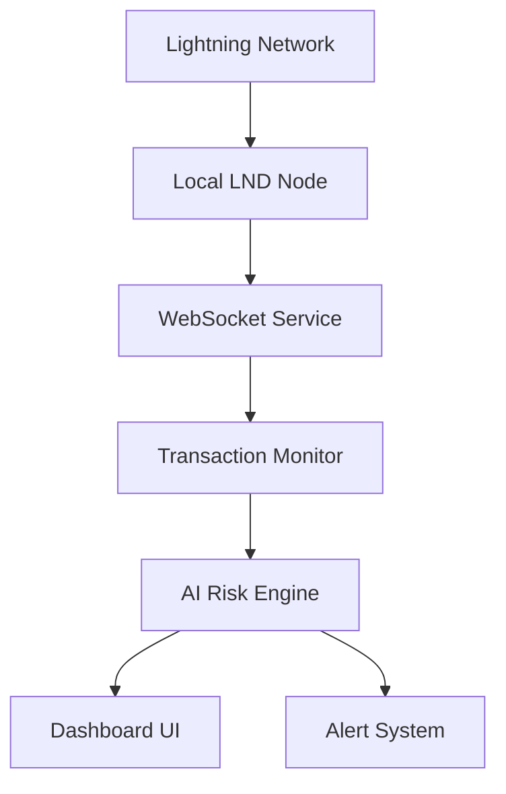

# ⚡ Lightning Sentinel

AI-powered financial watchdog on Bitcoin's Lightning Network. Monitors transactions, detects anomalies, and provides smart wallet recommendations.


## 🌟 Why This Matters

In the era of self-custody and decentralized finance, monitoring Lightning Network transactions has become crucial. Lightning Sentinel combines the power of local AI with Bitcoin's Lightning Network to provide:

- Real-time transaction monitoring without compromising privacy
- AI-powered risk analysis running completely locally
- Decentralized financial intelligence accessible to everyone

## 🔥 Features

- **Real-time Lightning Network Monitoring**
  - Live transaction flow visualization
  - Instant alerts for suspicious activities
  - Privacy-preserving Taproot transaction analysis

- **Local-First AI Analysis**
  - Transaction pattern recognition
  - Risk scoring for wallets
  - Natural language explanations of complex transactions
  - No cloud dependencies - everything runs on your machine

- **Modern Dashboard**
  - Interactive real-time charts
  - Transaction history with risk levels
  - AI-generated alerts for unusual activity
  - Dark mode UI optimized for monitoring

## 🛠️ Tech Stack


- React + Vite for frontend
- TensorFlow.js for local AI processing
- Lightning Network integration via LND
- Real-time updates with WebSocket
- Chart.js for visualizations

## 🏗️ Architecture



## 🚀 Setup

```bash
# Install dependencies
npm install

# Start development server
npm run dev

# Build for production
npm run build
```

## 🔒 Privacy & Security

- All analysis runs locally on your machine
- No external API calls or data collection
- Compatible with Taproot for enhanced privacy
- Self-custody focused - you control your keys

## 📝 License

MIT License - feel free to use and modify!
